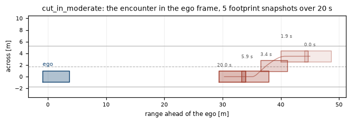

# Av Scenario Runner

Declarative scenario format and regression harness for evaluating autonomous driving controllers.

[](https://github.com/Eelis03/av-scenario-runner/actions/workflows/ci.yml)
[](https://www.python.org/downloads/)
[](LICENSE)

Write a driving situation as a validated TOML document, simulate it deterministically, and score it
against assertions that report the worst value observed and the second it happened. The reason to
do that rather than run the controller and look at the plots is below, and it is the whole argument
for this repository.


That run does not crash. A harness that counted crashes would call it clean, and it would be wrong
on both of the things that matter: the ego had 0.707 s to contact against a 1.5 s requirement, and
it bought that margin by braking at the physical limit of the model. A verdict cannot carry any of
this. A worst value, its time, and the bound it was tested against can.

## A scenario

One file describes the road, the vehicle under test, the traffic around it, when to stop, and what
must hold. This is `scenarios/cut_in_moderate.toml`, complete and unabridged.

```toml
# A neighbouring vehicle changes into the ego lane ahead with a workable gap.
# The ego is expected to yield without leaving its comfort band.
format_version = "1.1"
name = "cut_in_moderate"
description = "Adjacent lane vehicle cuts in 45 m ahead over three seconds while travelling slower."
expected_outcome = "pass"
dt = 0.05
seed = 1

[road]
kind = "straight"
lanes = 2
lane_width = 3.5
length = 400.0
speed_limit = 13.9

[ego]
lane = 0
s = 0.0
speed = 13.5
controller = "idm_lane_keep"

[ego.longitudinal]
desired_speed = 13.9
time_gap = 1.4
min_gap = 2.0
max_accel = 1.4
comfort_decel = 2.0

[[actor]]
id = "cutter"
lane = 1
s = 45.0
speed = 11.5
behaviour = "scripted"
schedule = [{ time = 0.0, accel = 0.0 }]
lane_change = { target_lane = 0, start_time = 2.0, duration = 3.0 }

[termination]
max_time = 20.0
goal_s = 200.0

[[assert]]
kind = "no_collision"

[[assert]]
kind = "min_distance"
threshold = 0.8

[[assert]]
kind = "min_time_to_collision"
threshold = 1.5

[[assert]]
kind = "longitudinal_acceleration"
minimum = -3.5
maximum = 2.0

[[assert]]
kind = "lateral_acceleration"
limit = 1.5

[[assert]]
kind = "speed_limit"
tolerance = 0.1
```

Which is this situation. The ego is held at the origin and everything is drawn relative to it, so
the footprints stay true rectangles at one to one scale instead of collapsing to specks on a 400 m
road.



Nothing in the document is optional in the sense of being ignorable. Every field is validated before
anything runs, and an unknown key is an error rather than a warning, because a document containing
`lane_with = 3.5` instead of `lane_width = 3.5` does not test what its author believes it tests, and
it would otherwise pass. Errors carry a location recovered from the source text:

```
unknown_road_key.toml:6: road.lane_with: unknown key; permitted keys are: kind, lane_width, lanes, length, speed_limit
unknown_controller.toml:9: ego.controller: unknown controller 'mpc_lateral'; known controllers are: constant_speed, idm_lane_keep
schedule_not_monotonic.toml:10: actor[0].schedule[1].time: schedule times must strictly increase, got 0.0 after 0.0
perception_in_version_1_0.toml: perception: the [perception] table requires format_version 1.1 or later; this document declares 1.0
```

`uv run python examples/validate_scenarios.py` prints all twenty two of those, one per malformed
fixture, and round trips every shipped scenario through the parser and the serialiser on the way.

The eight assertion kinds are `no_collision`, `min_distance`, `min_time_to_collision`,
`min_time_headway`, `longitudinal_acceleration`, `lateral_acceleration`, `speed_limit` and
`goal_reached`. The last two safety metrics are both there because neither implies the other. Time
to collision is a function of the relative motion and goes to infinity the moment the closing speed
does, so a vehicle followed two metres behind at a matched speed is scored as perfectly safe;
headway divides the gap by the ego's own speed and does not care whether the gap is closing. In
`tests/test_pipeline.py::test_headway_catches_the_tailgater_that_time_to_collision_calls_clean` an
ego settles into a headway of 0.744 s while its time to collision never falls below 12.9 s, and both
are scored against the same 1.5 s bound. An actor is
either `scripted`, meaning an acceleration schedule and at most one lane change, both closed form
functions of time, or `reactive`, meaning it follows whatever is ahead of it using the Intelligent
Driver Model, the ego included. A scripted actor cannot react to the controller under test, which is
deliberate: the provocation a scenario applies has to be fixed by the document, or the scenario
becomes a different experiment for every candidate controller.

## Running it

```bash
uv run python -m scenario_runner run scenarios/cut_in_moderate.toml
```

```
scenario suite: 1 scenarios, 1 passed, 0 failed, 0 unexpected

PASS cut_in_moderate                expect pass  6 assertions   20.00 s   401 steps  ended on max_time
    PASS no_collision                   worst    24.799 m      at  20.00s  bound > 0 m
    PASS min_distance                   worst    24.799 m      at  20.00s  bound >= 0.8 m
    PASS min_time_to_collision          worst    15.738 s      at   2.10s  bound >= 1.5 s
    PASS longitudinal_acceleration      worst    -1.157 m/s^2  at   3.30s  bound in [-3.5, 2] m/s^2
    PASS lateral_acceleration           worst     0.000 m/s^2  at   0.00s  bound |a| <= 1.5 m/s^2
    PASS speed_limit                    worst    13.792 m/s    at   3.30s  bound <= 14 m/s

literal exit code 0, expectation exit code 0
```

The worst value is printed for passing assertions as well as failing ones. That is the point of the
report. This run clears its `min_distance` threshold by 24.0 m; `lead_vehicle_braking` in the same
suite clears the same kind of threshold by 0.29 m. That difference does not appear in a verdict, and
it is exactly the difference that predicts which scenario breaks next week.

A whole suite runs from the same subcommand, and gates a build:

```bash
uv run python -m scenario_runner run scenarios/*.toml --expect \
    --json outputs/suite_result.json --report outputs/suite_report.txt
```

`--expect` scores every scenario against the `expected_outcome` its document declares, so a suite
that deliberately contains scenarios which must fail still exits zero when each behaves as
documented. Without the flag the rule is literal: any failing assertion fails the suite. Both exit
codes are printed on the last line of every report, so neither rule is hidden.

From Python:

```python
from scenario_runner import load_scenario
from scenario_runner.pipeline import run_scenario

scenario = load_scenario("scenarios/cut_in_moderate.toml")
result, trace = run_scenario(scenario)
for item in result.assertions:
    print(f"{item.outcome} {item.name}: worst {item.worst_value:.3f} {item.unit} at {item.worst_time:.2f} s")
```

Six runnable scripts in `examples/` wire the package together and have no logic of their own:

```bash
uv run python examples/run_scenario_suite.py       # the full suite, text report and JSON result
uv run python examples/regression_check.py         # this run against the recorded baseline
uv run python examples/validate_scenarios.py       # round trips and located rejection messages
uv run python examples/plot_scenario.py --scenario cut_in_moderate
uv run python examples/make_figures.py             # the three figures on this page
uv run python examples/export_viz_trace.py --scenario aggressive_cut_in
```

A browser playback of an exported trace lives in `viz/`, written in TypeScript against the Canvas
API with no runtime dependency and no content delivery network reference, and is never imported by
the Python package. See [viz/README.md](viz/README.md).

## Installation

Requires Python 3.12 or later.

```bash
git clone https://github.com/Eelis03/av-scenario-runner.git
cd av-scenario-runner
uv sync --all-extras --dev
```

Using pip instead of uv:

```bash
python -m venv .venv
.venv/bin/activate      # Windows: .venv\Scripts\activate
pip install -e ".[dev]"
```

Scenario parsing uses the standard library `tomllib` and adds no dependency. The two runtime
dependencies are numpy, for the trace arrays and the vectorised geometry queries, and matplotlib,
for the figures. The package ships `py.typed`, so a project that installs it gets the types the
package was checked against rather than `Any`.

## Results

The shipped suite is ten scenarios: free driving, lead vehicle braking, a stopped obstacle, two cut
ins, a merge, a reactive tailgater, a curved road, and speed limit compliance. Two of them are
expected to fail, and they fail differently on purpose. Every number below is the output of

```bash
uv run python -m scenario_runner run scenarios/*.toml --expect
```

on Python 3.12 with numpy 2.5.1, at `dt = 0.05` s.

```
scenario suite: 10 scenarios, 8 passed, 2 failed, 0 unexpected

FAIL aggressive_cut_in              expect fail  5 assertions   16.00 s   321 steps  ended on max_time
    PASS no_collision                   worst     1.652 m      at   1.90s  bound > 0 m
    PASS min_distance                   worst     1.652 m      at   1.90s  bound >= 1 m
    FAIL min_time_to_collision          worst     0.707 s      at   1.45s  bound >= 1.5 s
    FAIL longitudinal_acceleration      worst    -8.000 m/s^2  at   0.95s  bound in [-3, 2] m/s^2
    PASS lateral_acceleration           worst     0.000 m/s^2  at   0.00s  bound |a| <= 1.5 m/s^2

PASS curved_lane_keeping            expect pass  5 assertions   20.00 s   401 steps  ended on max_time
    PASS no_collision                   worst    35.492 m      at  20.00s  bound > 0 m
    PASS min_distance                   worst    35.492 m      at  20.00s  bound >= 1 m
    PASS lateral_acceleration           worst     1.231 m/s^2  at   8.40s  bound |a| <= 2.5 m/s^2
    PASS longitudinal_acceleration      worst     0.894 m/s^2  at   0.00s  bound in [-3, 2] m/s^2
    PASS speed_limit                    worst    13.588 m/s    at   8.40s  bound <= 15.1 m/s

PASS cut_in_moderate                expect pass  6 assertions   20.00 s   401 steps  ended on max_time
    PASS no_collision                   worst    24.799 m      at  20.00s  bound > 0 m
    PASS min_distance                   worst    24.799 m      at  20.00s  bound >= 0.8 m
    PASS min_time_to_collision          worst    15.738 s      at   2.10s  bound >= 1.5 s
    PASS longitudinal_acceleration      worst    -1.157 m/s^2  at   3.30s  bound in [-3.5, 2] m/s^2
    PASS lateral_acceleration           worst     0.000 m/s^2  at   0.00s  bound |a| <= 1.5 m/s^2
    PASS speed_limit                    worst    13.792 m/s    at   3.30s  bound <= 14 m/s

PASS follower_tailgate              expect pass  5 assertions   20.00 s   401 steps  ended on max_time
    PASS no_collision                   worst     5.546 m      at  19.50s  bound > 0 m
    PASS min_distance                   worst     5.546 m      at  19.50s  bound >= 0.5 m
    PASS min_time_to_collision          worst     5.159 s      at   7.70s  bound >= 1.2 s
    PASS longitudinal_acceleration      worst    -1.161 m/s^2  at   7.00s  bound in [-3.5, 2] m/s^2
    PASS speed_limit                    worst    13.023 m/s    at   3.05s  bound <= 14 m/s

PASS lead_vehicle_braking           expect pass  5 assertions   20.00 s   401 steps  ended on max_time
    PASS no_collision                   worst     1.090 m      at  17.20s  bound > 0 m
    PASS min_distance                   worst     1.090 m      at  17.20s  bound >= 0.8 m
    PASS min_time_to_collision          worst     1.812 s      at  10.85s  bound >= 1.5 s
    PASS longitudinal_acceleration      worst    -2.726 m/s^2  at   8.35s  bound in [-4, 2] m/s^2
    PASS speed_limit                    worst    13.000 m/s    at   0.00s  bound <= 14 m/s

PASS merge_from_ramp                expect pass  5 assertions   22.00 s   441 steps  ended on max_time
    PASS no_collision                   worst    21.184 m      at   8.90s  bound > 0 m
    PASS min_distance                   worst    21.184 m      at   8.90s  bound >= 0.8 m
    PASS min_time_to_collision          worst     8.011 s      at   3.05s  bound >= 1.5 s
    PASS longitudinal_acceleration      worst    -3.370 m/s^2  at   4.25s  bound in [-4, 2] m/s^2
    PASS goal_reached                   worst    16.900 s      at  16.90s  bound <= 21 s

PASS speed_limit_compliance         expect pass  4 assertions   20.00 s   401 steps  ended on max_time
    PASS speed_limit                    worst    13.900 m/s    at  20.00s  bound <= 14 m/s
    PASS longitudinal_acceleration      worst     1.318 m/s^2  at   0.00s  bound in [-3, 2] m/s^2
    PASS no_collision                   worst       inf m      at   n/a    bound > 0 m
    PASS goal_reached                   worst    17.950 s      at  17.95s  bound <= 19.5 s

PASS stopped_obstacle               expect pass  5 assertions   25.00 s   501 steps  ended on max_time
    PASS no_collision                   worst     1.566 m      at  16.30s  bound > 0 m
    PASS min_distance                   worst     1.566 m      at  16.30s  bound >= 1 m
    PASS min_time_to_collision          worst     1.964 s      at  11.40s  bound >= 1.5 s
    PASS longitudinal_acceleration      worst    -1.647 m/s^2  at   9.65s  bound in [-4, 2] m/s^2
    PASS speed_limit                    worst    13.500 m/s    at   0.00s  bound <= 14 m/s

FAIL stopped_obstacle_no_brake      expect fail  5 assertions    7.30 s   147 steps  ended on collision
    FAIL no_collision                   worst    -0.408 m      at   7.30s  bound > 0 m
    FAIL min_distance                   worst    -0.408 m      at   7.30s  bound >= 1 m
    FAIL min_time_to_collision          worst     0.000 s      at   7.30s  bound >= 1.5 s
    FAIL goal_reached                   worst     7.300 s      at   7.30s  bound <= 18 s
    PASS speed_limit                    worst    13.000 m/s    at   0.00s  bound <= 14 m/s

PASS straight_cruise                expect pass  5 assertions   19.50 s   391 steps  ended on goal
    PASS no_collision                   worst       inf m      at   n/a    bound > 0 m
    PASS speed_limit                    worst    13.895 m/s    at  19.50s  bound <= 14 m/s
    PASS longitudinal_acceleration      worst     1.246 m/s^2  at   0.00s  bound in [-3, 2] m/s^2
    PASS lateral_acceleration           worst     0.000 m/s^2  at   0.00s  bound |a| <= 1.5 m/s^2
    PASS goal_reached                   worst    19.500 s      at  19.50s  bound <= 22 s

failing scenarios:
  aggressive_cut_in: min_time_to_collision, longitudinal_acceleration
  stopped_obstacle_no_brake: no_collision, min_distance, min_time_to_collision, goal_reached

literal exit code 1, expectation exit code 0
```

Two failing scenarios ship because a harness that has never been observed to detect a failure has no
evidence behind it. `stopped_obstacle_no_brake` drives the deliberately unsafe `constant_speed`
controller into a stationary vehicle: clearance reaches -0.408 m at t = 7.30 s, the run terminates
on contact after 147 of the 401 steps its 20 s budget allows, and four of its five assertions fail.
`aggressive_cut_in` is the graded case in the figure at the top of this page, and it is why the
report prints worst values rather than verdicts.

Two of the passing numbers are checks rather than results. `curved_lane_keeping` reports a peak
lateral acceleration of 1.231 m/s^2 at t = 8.40 s and a peak speed of 13.588 m/s at the same
instant; on a 150 m radius, `v^2 / R` is 1.2309 m/s^2, so the simulator and the metric agree with
the closed form to four figures. `speed_limit_compliance` asks for a desired speed of 20.0 m/s on a
13.9 m/s road and reports a peak of 13.900 m/s, which is the controller respecting the limit exactly
rather than approximately.

### Which passes were nearly failures

Forty of the fifty assertions above have a bound that a worst value can be divided by, and dividing
puts metres, seconds and accelerations on one dimensionless scale. One is the bound.


The ranking is the argument. `speed_limit_compliance.speed_limit` passes at 0.993 of its bound and
`straight_cruise.speed_limit` at 0.992, while `curved_lane_keeping.min_distance` passes at 0.028.
All three print `PASS`. The first two will not survive much of a change to the controller and the
third will survive almost any. `no_collision` is left out of the ranking because its bound is zero
and no ratio to zero exists; every scenario that declares it also declares `min_distance` over the
same series against a stated threshold.

### Against a recorded baseline

`baselines/reference_suite.json` is a complete recorded run. Comparing a fresh unmodified run
against it reports no differences and exits zero. Comparing a deliberately truncated run against it
shows both categories of difference at once:

```bash
uv run python -m scenario_runner run scenarios/*.toml --json outputs/truncated.json \
    --max-steps 120 --quiet
uv run python -m scenario_runner compare outputs/truncated.json baselines/reference_suite.json
```

```
comparison against baseline: 29 difference(s)

  new_failure        merge_from_ramp.goal_reached                     verdict moved from pass to fail, worst value 16.9 to 6
  new_failure        speed_limit_compliance.goal_reached              verdict moved from pass to fail, worst value 17.95 to 6
  new_failure        straight_cruise.goal_reached                     verdict moved from pass to fail, worst value 19.5 to 6
  resolved_failure   stopped_obstacle_no_brake.min_distance           verdict moved from fail to pass, worst value -0.408205 to 16.4918
  resolved_failure   stopped_obstacle_no_brake.no_collision           verdict moved from fail to pass, worst value -0.408205 to 16.4918
  metric_moved       curved_lane_keeping.lateral_acceleration         verdict held at pass, worst value 1.23085 to 1.21473 (-1.310 percent)
  metric_moved       lead_vehicle_braking.min_time_to_collision       verdict held at pass, worst value 1.81197 to 6.53204 (+260.494 percent)
  metric_moved       stopped_obstacle.longitudinal_acceleration       verdict held at pass, worst value -1.64704 to -0.917018 (+44.323 percent)
  ...

new failures 3, renames 0, moved metrics 24, regressed True
tolerance: relative 1e-06, absolute 1e-09
```

A verdict that changed, and a scenario or assertion that disappeared, set the exit code. A metric
that moved while its verdict held does not, because it may be a deliberate tuning change and it may
be the last quiet step before a failure, and only the person reading it can tell which.

Renaming a scenario used to be reported as a removal, which is a regression, plus an unrelated
addition, when nothing had changed except a string. Renames are now matched by content the way a
version control system matches them, so running the suite with `merge_from_ramp.toml` renamed to
`ramp_merge.toml` produces exactly this, and exits zero:

```
comparison against baseline: 1 difference(s)

  scenario_renamed   merge_from_ramp -> ramp_merge                    matched to the baseline scenario 'merge_from_ramp' by identical results, 5 assertions unchanged

new failures 0, renames 1, moved metrics 0, regressed False
tolerance: relative 1e-06, absolute 1e-09
```

A pair is accepted only when every assertion agrees in name, kind, verdict and worst value to the
comparison tolerance, and only when each side is the other's single candidate; two candidates on
either side are left reported as a removal and an addition rather than guessed at. What the rule
costs, and why a stable identifier written into each document was not the answer instead, is under
closed limitations in [docs/design-notes.md](docs/design-notes.md).

### Tests and coverage

```bash
uv run pytest --cov=src/scenario_runner --cov-report=term-missing
```

157 tests pass in about 13 seconds on one core, covering 97 per cent of the package by statement. The
suite has three tiers. Tier one checks properties: every assertion is scored against a hand built
trace whose correct verdict is known by inspection, and scored again with the observed value placed
exactly on its threshold; twenty two malformed documents are each rejected with a message naming the
offending field, against a table that must match the fixture directory exactly; and the simulator is
checked to be identical across seeds without perception noise, identical for a repeated seed with
it, and different across seeds with it, so the determinism test is not vacuous. Tier two is the
baseline comparison above. Tier three runs every script in `examples/` as a subprocess under a
reduced step count and requires each to exit zero.

CI enforces `--cov-fail-under=95` in the Python test job, two points below the measured figure so
that a genuine drop is caught while an incidental one point movement is not. That job runs on Ubuntu
and on Windows; a third job type checks and builds the browser playback.

### About the figures

The three figures on this page are snapshots of a real run, tracked in `docs/figures` and 143 kB in
total. One command rewrites all three:

```bash
uv run python examples/make_figures.py
```

CI does not compare them byte for byte. Matplotlib output is not byte reproducible across platforms,
and a check that fails because a font hinted differently on another operating system is a check that
gets switched off. What is enforced instead is that every published figure is a real PNG, that the
set fits its size budget, and that each one is embedded in this page with alt text that describes
what it shows, which are the failures that actually happen.

## What this does not tell you

Passing this suite is evidence about these ten scenarios. It is not evidence about the controller in
general, about scenarios nobody wrote, or about the distribution of situations the controller would
meet in service. Kalra and Paddock (2016) show that establishing autonomous vehicle safety by
accumulating road miles needs hundreds of millions of miles, which is why scenario based assessment
exists at all; Riedmaier et al. (2020) survey how scenarios get generated and selected, and none of
the approaches yields a completeness argument. Scenario testing swaps the question of how many miles
are enough for the question of which scenarios are enough, and this repository does not answer the
second one either.

What it does provide is narrower and worth having: a change that breaks one of these ten specific
situations is caught before it merges, with the worst value and the time it occurred attached, and
the same ten situations are scored the same way every time. That is regression detection, not a
safety case.

The model has stated limits as well. The ego's leader search uses a footprint overlap band, so it
sees a cut in later than lane level tracking would, which is why the merge scenario has to place its
vehicle 50 m ahead rather than 30 m. The kinematic bicycle has no tyre model, so lateral acceleration
above roughly 4 m/s^2 is not physically meaningful. There is no lane change planner for the ego, so a
scenario that can only be passed by changing lanes cannot be passed at all. The road is a single
straight or a single arc. Perception noise is Gaussian, with no occlusion, no false negative, no
latency and no track loss, which are the failures that dominate real perception. Each of these is
written up, with what closing it would take, in [docs/design-notes.md](docs/design-notes.md).

## How it is built

Five layers, each depending only on those below it. The direction is enforced by the import graph
rather than by convention: the scoring code reads a run through a structural protocol
(`algorithm/trace_view.py`) instead of importing the simulator that produced it, and a test asserts
that no file under `src/` or `tests/` mentions `viz/`.

| Module | Responsibility |
| --- | --- |
| `model/scenario.py` | Typed, frozen scenario dataclasses and the supported format versions |
| `model/parser.py` | TOML parsing and strict validation, one located error per rejection |
| `model/locate.py` | Recovery of a source line number for a dotted field path |
| `model/serialise.py` | Rendering a validated scenario back to TOML for the round trip |
| `model/geometry.py` | Road frame conversions for a straight or constant curvature road |
| `algorithm/metrics.py` | Disc cover clearance, two dimensional time to collision, and time headway |
| `algorithm/assertions.py` | The assertion vocabulary, each reporting worst value and time |
| `algorithm/compare.py` | Baseline comparison, rename matching, and the magnitude class |
| `algorithm/trace_view.py` | The structural view of a run that the scoring code requires |
| `pipeline/dynamics.py` | Kinematic bicycle integration and the Intelligent Driver Model |
| `pipeline/controllers.py` | The two reference controllers and their registry |
| `pipeline/actors.py` | Scripted and reactive actor state in road coordinates |
| `pipeline/simulator.py` | The deterministic fixed step loop |
| `pipeline/runner.py` | Per scenario results, suite results, and the two exit code rules |
| `analysis/report.py` | Text rendering of suite results and comparisons |
| `analysis/results.py` | Strict JSON encoding and decoding of suite results |
| `analysis/figures.py` | The three published figures and the per scenario summary |
| `analysis/export.py` | Versioned JSON trace for the browser playback |
| `cli.py` | Argument parsing and wiring for `run` and `compare` |

The methods are published ones rather than invented ones. Time to collision follows the constant
velocity definition of Hayward (1972), generalised to two dimensions so that a lateral encounter
such as a cut in is scored at all, rather than only once the cutting vehicle is already in the lane.
Time headway is the same query solved with the other vehicle held stationary, the indicator Vogel
(2003) compares against time to collision and finds cannot be substituted for it.
Footprints are covered by three equal discs along the vehicle axis, the fast collision approximation
of Ziegler and Stiller (2010), which makes clearance and time to collision the same closed form
query; the cover is conservative by 0.454 m at each bumper and 0.271 m at each side for the default
footprint, and that constant is documented so a threshold can be set knowingly. The reference
controller combines the Intelligent Driver Model (Treiber, Hennecke and Helbing, 2000) with pure
pursuit lane keeping (Coulter, 1992), driving a rear axle kinematic bicycle (Kong et al., 2015)
integrated with a fixed step Runge-Kutta scheme. There is no optimisation, no iterative solve and no
adaptive step anywhere in the simulation path, so a run is a pure function of the document and the
seed. Which quantities a regression baseline may therefore pin, and which it must not, is the long
argument in [docs/design-notes.md](docs/design-notes.md).

Dependencies:

| Package | Purpose | Licence |
| --- | --- | --- |
| [numpy](https://numpy.org/) | Trace storage and the vectorised clearance and time to collision queries | BSD-3-Clause |
| [matplotlib](https://matplotlib.org/) | Figures, rendered through the Agg canvas with no interactive backend | Matplotlib licence, BSD compatible |
| [pytest](https://docs.pytest.org/) and [pytest-cov](https://pytest-cov.readthedocs.io/) | Test runner and coverage measurement, development only | MIT |
| [ruff](https://docs.astral.sh/ruff/) | Linting, development only | MIT |
| [mypy](https://mypy-lang.org/) | Static type checking in strict mode, development only | MIT |
| [typescript](https://www.typescriptlang.org/) | Compiles `viz/src` to ES modules, development only, not a runtime dependency of anything | Apache-2.0 |

## References

Scenario description and safety assessment:

- ASAM e.V. *ASAM OpenSCENARIO XML*, specification 1.2.0, 2022. Stable URL:
  <https://www.asam.net/standards/detail/openscenario-xml/>. The document structure here follows
  its separation of road, entities, storyboard, and stop trigger.
- Menzel, T., Bagschik, G., Maurer, M. "Scenarios for Development, Test and Validation of Automated
  Vehicles." *IEEE Intelligent Vehicles Symposium*, 2018, pp. 1821-1827. DOI:
  [10.1109/IVS.2018.8500406](https://doi.org/10.1109/IVS.2018.8500406). Source of the functional,
  logical, and concrete scenario distinction; every document here is a concrete scenario.
- Riedmaier, S., Ponn, T., Ludwig, D., Schick, B., Diermeyer, F. "Survey on Scenario-Based Safety
  Assessment of Automated Vehicles." *IEEE Access*, 8, 2020, pp. 87456-87477. DOI:
  [10.1109/ACCESS.2020.2993730](https://doi.org/10.1109/ACCESS.2020.2993730).
- Kalra, N., Paddock, S. M. "Driving to safety: How many miles of driving would it take to
  demonstrate autonomous vehicle reliability?" *Transportation Research Part A: Policy and
  Practice*, 94, 2016, pp. 182-193. DOI:
  [10.1016/j.tra.2016.09.010](https://doi.org/10.1016/j.tra.2016.09.010). The reason a scenario
  suite is evidence about its own scenarios and nothing more.

Safety metrics:

- Hayward, J. C. "Near-miss determination through use of a scale of danger." *Highway Research
  Record*, 384, Highway Research Board, 1972, pp. 24-34. Stable URL:
  <https://onlinepubs.trb.org/Onlinepubs/hrr/1972/384/384-004.pdf>. The constant velocity time to
  collision definition implemented in `algorithm/metrics.py`.
- Vogel, K. "A comparison of headway and time to collision as safety indicators." *Accident
  Analysis and Prevention*, 35(3), 2003, pp. 427-433. DOI:
  [10.1016/S0001-4575(02)00022-2](https://doi.org/10.1016/S0001-4575(02)00022-2). The finding that
  the two indicators identify different situations, which is why the vocabulary carries both.
- Shalev-Shwartz, S., Shammah, S., Shashua, A. "On a Formal Model of Safe and Scalable Self-Driving
  Cars." arXiv preprint, 2017. DOI:
  [10.48550/arXiv.1708.06374](https://doi.org/10.48550/arXiv.1708.06374). Responsibility sensitive
  safety, the source of the longitudinal and lateral safe distance framing the `min_distance`
  assertion approximates. The full formal model is not implemented here; see the design notes.
- Ziegler, J., Stiller, C. "Fast collision checking for intelligent vehicle motion planning."
  *IEEE Intelligent Vehicles Symposium*, 2010, pp. 518-522. DOI:
  [10.1109/IVS.2010.5547976](https://doi.org/10.1109/IVS.2010.5547976). The disc cover
  approximation of a rectangular footprint used for clearance and collision.

Vehicle and driver models:

- Treiber, M., Hennecke, A., Helbing, D. "Congested traffic states in empirical observations and
  microscopic simulations." *Physical Review E*, 62(2), 2000, pp. 1805-1824. DOI:
  [10.1103/PhysRevE.62.1805](https://doi.org/10.1103/PhysRevE.62.1805). The Intelligent Driver
  Model used by the reference controller and by reactive actors.
- Kong, J., Pfeiffer, M., Schildbach, G., Borrelli, F. "Kinematic and dynamic vehicle models for
  autonomous driving control design." *IEEE Intelligent Vehicles Symposium*, 2015, pp. 1094-1099.
  DOI: [10.1109/IVS.2015.7225830](https://doi.org/10.1109/IVS.2015.7225830). The kinematic bicycle
  model and the conditions under which it is an adequate substitute for a dynamic model.
- Coulter, R. C. *Implementation of the Pure Pursuit Path Tracking Algorithm.* Technical Report
  CMU-RI-TR-92-01, Robotics Institute, Carnegie Mellon University, 1992. Stable URL:
  <https://www.ri.cmu.edu/publications/implementation-of-the-pure-pursuit-path-tracking-algorithm/>.
  The lane keeping law.

## License

Released under the MIT license. See [LICENSE](LICENSE).
